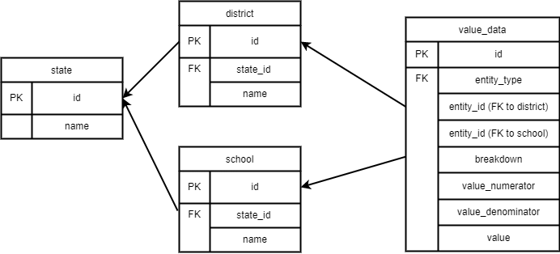

Title: Submission to GreatSchools' Take Home Assignment - Data Engineer I

Description: This is an assignment is aimed at understanding how I, as a potential candiate for the Data Engineer I role at GreatSchools' Data Engineering Team would approach creating an ETL Pipeline, from raw data to the data warehouse. The goal of the assignment is to load new college-going rates in percentage for the state of Wisconsin (WI) for the College Success Awards for the year of 2021 while the data from the Wisconsin Department of Education did not come in a readily loadable format for the data project. This assignment is aimed at creating a scriptable solution for transforming the underlying data files into a state that can be ingested by GreatSchools' data warehouse. The assignment is completed by three parts: Part 1 Data Quality Assurance, Part 2 Data Processing, and Part 3 Data Storage.

Technologies:

1. Python: The Python programming language will be used for data preprocessing, data cleaning, and data transformation. The Pandas library will be used to manipulate and analyze the datasets. Advanced modules like openpyxl will be used for data analysis.

2. Apache Spark: Apache Spark is a distributed computing system that will be used for data processing. Spark Core will be used for parallel processing, while Spark SQL will be used for data querying.

3. Python Analytics libraries: Python Analytics libraries like sqlite3 will be used for data analysis.

Parts:

1. Data Quality Assurance: This part of assignment is completed by `Part 1 Data Quality Assurance.py` that reads in the two CSV files provided in the assignment, using the pd.read_csv() function from the pandas library. It then performs various checks on the data to identify any errors or inconsistencies. The first few rows of each DataFrame are printed using the .head() function and last few rows of each DataFrame are printed using the .tail() function. To give a sense of what the data looks like. The .dtypes function is used to check the data types of each column, and the .isnull().sum() function is used to check for missing values. The .duplicated().sum() function is used to check for duplicates in the data. It is valuable to note "SCHOOL_CODE\r\n" field from enrollment_df has 15603 missing values while "SCHOOL_CODE" field from completion_df has 38010 missing values to realize the potential inconsistencies of the two raw data files. 

    The raw data files to be used for processing will be acquired as csv files. Please download all four files in csv format:

   - `postsecondary_enrollment_current_2020_21.csv`: This file contains the postsecondary details.
   - `Hs_completion_certified_2020-21.csv`: This file contains all graduation information.
  
2. Data Processing: This part of assignment is completed by `Part 2 Data Processing.py` that will process the raw data files according to the `DE I Data Processing Guide.pdf` which is included in my repo. The raw data files will be cleaned and transformed by applying various data cleaning techniques like data normalization, standardization, outlier removal to replace null values with default values, and filtration on irrelevant data for each DataFrame. 

    The data in "DISTRICT_CODE" and "SCHOOL_CODE" of the two DataFrames have many inconsistencies that some are appeared in [null] and digits are ranging from 1 to 4 digits. This will be standardized by replacing [null] values with default value 9999 and adding "0" in front of DISTRICT_CODE and SCHOOL_CODE columns to have 4 digits in total. This will be crucial to construct the "state_id" field by concatenating "DISTRICT_CODE" with "SCHOOL_CODE" so that the result values are standarized. In the meantime, it is crucial to rename that "DISTRICT_NAME" to "district_name" and "SCHOOL_NAME", "school_name" in the enrollment_df DataFrame and "DISTRICT_CODE " to "DISTRICT_CODE" in the completion_df DataFrame. This will be necessary to achieve attribute accuracy so the later code can run without AttributeError. 

    Moreover, `Part 2 Data Processing.py` will aggregate the two DataFrames based on four fields: "SCHOOL_YEAR", "DISTRICT_CODE", "SCHOOL_CODE", and "GROUP_BY_VALUE". Then, `Part 2 Data Processing.py` will define a window specification and create three new columns for the numerator and denominator of the value that represents the college-going rate: "value_numerator", "value_denominator", "value". At the end, `Part 2 Data Processing.py` will output an `output.xlsx` file, with one data value per row (as in `example_output.xlsx`) to show/display college-going rates for the state of Wisconsin(WI) for the year of 2021.

3. Data Storage  
    a. Here is a proposed data storage solution for storing the value data in the output.xlsx file, along with an ERD::   
    Assumptions: 

        There are two existing tables for storing unique entity (school/district) values, named "school" and "district".
        Both "school" and "district" tables have a primary key field named "id", which is unique for each school/district entity.
        Both "school" and "district" tables have a field named "state_id", which corresponds to the "state_id" field in the output.xlsx file.
        The "state" table is included to represent the assumption that there is a table in the database for storing state values that are linked to the school, district, and value_data tables via the state_id foreign key.

    Proposed data storage solution:
    
        Create a new table named "value_data" with the following fields:

            "id": Primary key field for the "value_data" table.
            "entity_type": Indicates whether the data pertains to a school or district entity.
            "entity_id": Foreign key field that links to either the "school" or "district" table.
            "breakdown": Indicates the ethnicity breakdown for the data.
            "value_numerator": Numerator for the data value.
            "value_denominator": Denominator for the data value.
            "value": Final calculated value based on numerator and denominator.
    ERD:
        
      
    b. Sample queries are provided in `Part 3 Data Storage.py` to answer the following requests:
        i. The number of schools with college-going rates for Hispanic students
        ii. The min and max school college-going rates, across all schools, for Asian students
        iii. The data coverage, by entity type, compared to last year (assume that the 2020 data also exists in your tables)

This Take Home Assignment - Data Engineer I requires technologies to manage an ETL process to load raw data to the data warehouse: Python (Pandas, advanced modules e.g., openpyxl), Apache Spark (Spark Core, Spark SQL), and Python Analytics libraries. I will set up environments and perform installations on local machines. 

Installation: In order to install my submission, please download everything my repo and use requirements.txt for python libraries that need to be installed.

Contact: For any questions or feedback, contact the author at jingrulin123@gmail.com.

